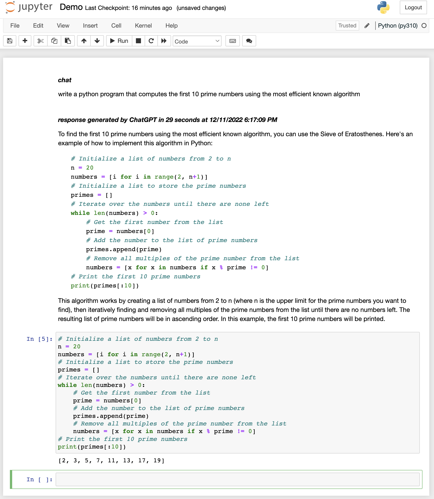

# ChatGPT for Jupyter

A browser extension that brings ChatGPT into your Jupyter notebooks. The way
I always describe Jupyter to my friends is that *it's a tool that handles
the mundane task of writing things down for you*. When I saw ChatGPT last 
week, I realized that there was no better home for ChatGPT than inside my
Jupyter notebooks.



# Installation

## Local Install for Chrome/Edge

1. Download `build.zip` from
   [Releases](https://github.com/jflam/chat-gpt-jupyter-extension/releases)
2. Unzip the file
3. In Chrome/Edge go to the extensions page (`chrome://extensions` or
   `edge://extensions`).
4. Enable Developer Mode.
5. Drag the unzipped folder anywhere on the page to import it (do not delete
   the folder afterwards).

## Build from source for Chrome/Edge

1. Clone the repo
2. Install dependencies with `npm`
3. Run `./build.sh` for Chrome.
4. Load the `build` directory to your browser

# Description of Jupyter-ChatGPT written by ... ChatGPT

Welcome to Jupyter-ChatGPT!

Jupyter is a highly productive user interface for ChatGPT, providing a number
of benefits to users:

- **Simplicity:** Jupyter simplifies the process of working with ChatGPT,
  allowing you to easily write and execute code without the need for
  complicated command-line interfaces or other tools.

- **Flexibility:** Jupyter provides a powerful and flexible platform for
  working with ChatGPT, allowing you to easily mix and match code, text, and
  other media to create custom chatbots and other interactive applications.

- **Collaboration:** Jupyter makes it easy to collaborate with others on
  ChatGPT projects, allowing you to share notebooks and work together in real
  time.

- **Portability:** Jupyter notebooks can be easily shared and run on a variety
  of platforms, making it easy to access and use ChatGPT from anywhere.

With Jupyter-ChatGPT, you can leverage the power of ChatGPT and Jupyter to
quickly and easily create custom chatbots and other interactive applications.
Give it a try and see for yourself how Jupyter can make working with ChatGPT a
breeze!

# Why a browser extension?
At the time that I created this project, ChatGPT was released as a technology
preview. That meant no public API.

One of the cool things that you can do with a browser extension is make 
cross-origin requests without being subject to the security constraints of
the browser. In effect, the browser extension runs in a privileged mode.

This lets me reuse the bearer token that is obtained by authenticating with
OpenAI. As long as the user can log into OpenAI through the official 
web site, this extension will be able to reuse that token to communicate
to the ChatGPT service from Jupyter.

The extension asks for permission to inject Javascript into `localhost` web
pages.

# Interaction Design
Below is a description of the ChatGPT query experience within a Jupyter
notebook. It also describes the behavior of the extension.

## ChatGPT queries
Users enter ChatGPT queries in a Jupyter markdown cell. For a markdown cell to
be a ChatGPT cell, the cell must have `##### chat` markdown in the first line
of the cell. 

```
##### chat

Write a Python program that implements the quicksort algorithm in a function and uses it to sort a list of 100 random integers. Show the list before and after sorting.
```

My rationale for choosing this identifier is that users of markdown cells
rarely use that level of indentation. It also formats distinctly (boldface
italics) when the markdown is rendered. I'm not happy with having to type FIVE
# characters before chat, so I'm open to suggestions about how to improve this
experience.

The markdown cell's metadata is tagged as follows:

```javascript
cell.metadata["chatgpt_cell"] = "query";
```

## Detecting the programming language
In the sample chat query cell above, I indicate that I would like ChatGPT to
write a **Python** program. 

The extension examines the contents of the query to look for mentions of a
programming language. This information is used later to ensure that the code
blocks returned from ChatGPT are formatted correctly. Modern syntax coloring
libraries like `highlight.js` can auto-detect the programming language, but
unfortunately Jupyter doesn't use `highlight.js` AFAIK, so I need to examine
the query text to infer the programming language.

The function `detectProgrammingLanguage(query)` will inspect the `query`
string to see if there are any mentions of the programming languages listed as
keys in the `keywordToProgrammingLanguage` dictionary. The first one is found
is the programming language tagged against the code blocks returned from
ChatGPT. If none is found the returned language is `unknown`.

The `keywordToProgrammingLanguage` dictionary maps strings to markdown
programming language identifiers. For example, there are entries for `c#` and
`csharp`  in the dictionary, both of which map to `csharp` as the identifier
for the programming language. This identifier is used to to decorate the code
blocks to ensure correct syntax coloring. 

The result of this analysis is saved in the cell metadata for that query cell
for future use. This is the Javascript code that saves these values:

```javascript
cell.metadata["chatgpt_language"]="<programming language>";
```

## ChatGPT threads
A Jupyter notebook can contain multiple ChatGPT threads. Each thread is
identified by a *thread name*:

`##### chat:<thread name>`

When the query is processed, the `thread name` is added to the cell metadata:

```javascript
cell.metadata["chatgpt_thread"]="<thread name>";
```

The *thread name* propagates to all result cells from that query. If *thread
name* is not present in a chat cell, e.g., it's an unadorned `chat` then the
`chatgpt_thread` value is an empty string.

## User interaction
When the user wants to send a query to ChatGPT, they hit SHIFT+ENTER within
the markdown cell. 

This keyboard shortcut is the same keyboard shortcut that is used to render
markdown, so it should be familiar to most Jupyter users.

## Build query string using existing context
When the query cell is processed the programming language (if any) and the
thread name are extracted from the user input.

The thread name is used to build the query context. The query context is how
ChatGPT maintains the "state" of the chat. There is no state (to my knowledge)
maintained on the ChatGPT server; all context must be passed from the client.

The set of Jupyter cells that form the query context is filtered by the
**thread name** if present. 

As mentioned later, the ChatGPT response typically contains code and that code
is extracted into independent code cells. The cell metadata in those code
cells are tagged with the thread name. So when constructing the query context,
code cells tagged with the thread name are included. 

One benefit of this design is that the user **can edit the code in those cells
directly** and those changes are sent back to ChatGPT. So the user now has a
choice between editing the code directly in the cell vs. instructing ChatGPT
to do the editing as part of the next query.

For now the original **raw** response is not included as part of the context.
This is experimental. If I find that ChatGPT performs poorly without that
context I will endeavour to reconstruct any changes made to the code cells and
merge those changes back into the original raw response and send that as part
of the context. 

There is a limit to the number of tokens that can be part of the query
context. I haven't empirically determined the maximum size of the query
context. Once I have, I'll add a limit constraint.

The user in a chat may start referring to previous code as "the program"
instead of saying "the **python** program". So in the event that we don't
detect a programming language reference in the query cell, we start going
backwards through the query context until we find the first cell that contains
a non-blank `chatgpt_language` field in its cell metadata and use that as the
language.

## Parsing the ChatGPT response
A ChatGPT response can contain a mixture of explanatory text and code blocks.
The response is streamed into a markdown cell which is created when the query
is sent to ChatGPT. That cell's metadata is tagged:

```javascript
cell.metadata["chatgpt_cell"]="raw_response";
cell.metadata["chatgpt_thread"]="<thread name>"; // or ""
cell.metadata["chatgpt_language"]="<programming language>";
```

The incremental nature of how the response is streamed back from the ChatGPT
server makes it resemble someone typing in the response. Since the ChatGPT
server is often under severe load, we initialize the `raw_response` markdown
cell with a waiting for a response message:

```
##### waiting for a response from ChatGPT...
```

Once the ChatGPT server has started streaming a response, the incremental
response is streamed into the markdown cell. At the top of the markdown cell,
we maintain a timer that shows how long the response has been streaming from
the server:

```
##### receiving response from ChatGPT. Elapsed time zz seconds

<response streamed here>...
```

Once the ChatGPT response has completed streaming, we parse the response to
extract the code blocks from the response. We generate separate Jupyter
notebook code cells for each code block in the raw response. Those code cells'
cell metadata is tagged:

```javascript
cell.metadata["chatgpt_cell"]="code";
cell.metadata["chatgpt_thread"]="<thread name>";
cell.metadata["chatgpt_language"]="<programming language>";
```

Users are free to execute or delete as oftentimes necessary because ChatGPT
tends to want to return additional explanatory information like how to run the
program or how to install a library unless you explicitly tell it not to.

If a cell is modified, the **modified code** is sent back to ChatGPT in
subsequent queries.
## Credit

This project is inspired by and forked from [Wang
Dàpéng/chat-gpt-google-extension](https://github.com/wong2/chat-gpt-google-extension)
This project is inspired by
[ZohaibAhmed/ChatGPT-Google](https://github.com/ZohaibAhmed/ChatGPT-Google)
